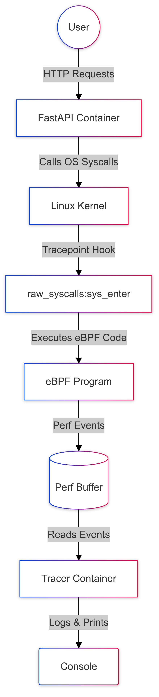

# eBPF Tracer + FastAPI Demo 🐳🔧

A hands-on project that combines FastAPI (Python) for a simple User + File CRUD service with eBPF (Go + C) for syscall tracing.

Both services run in Docker containers, orchestrated by docker-compose. This setup showcases how to trace syscalls in real time from the FastAPI container using eBPF.

## Table of Contents
- [✨ Features](#-features)
- [📁 Project Structure](#-project-structure)
- [🚀 Getting Started](#-getting-started)
  - [1. Clone the Repo](#1-clone-the-repo)
  - [2. Build & Run with Docker Compose](#2-build--run-with-docker-compose)
  - [3. Test the API](#3-test-the-api)
  - [Quick Testing](#quick-testing)
- [📝 eBPF Tracer Overview](#-ebpf-tracer-overview)
- [🐳 Docker Compose Notes](#-docker-compose-notes)
- [🛠 Troubleshooting](#-troubleshooting)
- [🏁 Wrap-up](#-wrap-up)
- [📄 License](#-license)

_____

<p align="center">
  
</p>

_____

## ✨ Features

* **FastAPI container:**
  * CRUD endpoints for managing users (SQLite)
  * Endpoints for uploading/downloading files

* **Tracer container:**
  * Go program + eBPF code hooking into raw_syscalls:sys_enter
  * Real-time logging of syscalls (PID, PPID, command name, syscall ID, timestamp)

* **Docker Compose integration:**
  * Share network and (optionally) PID namespace
  * Mount necessary debug/tracing file systems (/sys/kernel/debug, /sys/kernel/tracing, /sys/fs/bpf)

## 📁 Project Structure

```
.
├── docker-compose.yml
├── fastapi-server/
│   ├── Dockerfile
│   ├── main.py
│   ├── models.py
│   ├── schemas.py
│   ├── requirements.txt
│   └── ...
└── tracer/
    ├── Dockerfile
    ├── cmd/tracer/main.go
    ├── pkg/bpf/tracer.c
    ├── pkg/bpf/tracer.h
    └── ...
```

## 🚀 Getting Started

### 1. Clone the Repo

```bash
git clone https://github.com/your-org/ebpf-fastapi-demo.git
cd ebpf-fastapi-demo
```

### 2. Build & Run with Docker Compose

```bash
docker-compose up --build
```

* fastapi service will start on port 8000
* tracer service will attach to the raw_syscalls:sys_enter tracepoint

### 3. Test the API

Create a new user:
```bash
curl -X POST http://localhost:8000/users/ \
  -H "Content-Type: application/json" \
  -d '{"name": "Alice", "email": "alice@example.com"}'
```

Upload a file:
```bash
curl -F file=@localfile.txt http://localhost:8000/upload
```

Download a file:
```bash
curl -O http://localhost:8000/download/localfile.txt
```

### Quick Testing

To run a series of automated test actions:
```bash
cd fastapi-server
make test
```
This will execute several user operations to demonstrate the syscall tracing in action.

## 📝 eBPF Tracer Overview

* **main.go**: Loads and attaches the BPF program to the tracepoint, then reads events from a perf buffer
* **tracer.c**: C code that defines the handle_sys_enter function. It captures:
  * pid, ppid, comm (command name)
  * the syscall ID
  * the timestamp in nanoseconds

Events get pushed out to user space via a perf event buffer.

## 🐳 Docker Compose Notes

docker-compose.yml snippet:
```yaml
services:
  fastapi:
    build:
      context: ./fastapi-server
      dockerfile: Dockerfile
    ports:
      - "8000:8000"
    volumes:
      - ./fastapi-server:/app
    command: uvicorn main:app --host 0.0.0.0 --port 8000 --reload

  tracer:
    build:
      context: ./tracer
      dockerfile: Dockerfile
    privileged: true
    pid: "host"
    network_mode: "service:fastapi"
    volumes:
      - /sys/kernel/debug:/sys/kernel/debug
      - /sys/kernel/tracing:/sys/kernel/tracing
      - /sys/fs/bpf:/sys/fs/bpf
    depends_on:
      - fastapi
```

**Key points:**
* `privileged: true` + volumes for /sys/... are required to run eBPF inside Docker
* `pid: "host"` allows seeing the host PID namespace. If you only want to see container PIDs, set `pid: "service:fastapi"` or isolate further

## 🛠 Troubleshooting

1. **No events on macOS:**
   * eBPF only works on Linux. On macOS, Docker Desktop runs in a Linux VM, so you won't see macOS host processes—only the processes inside the Linux VM (i.e., your containers)

2. **Permission issues:**
   * Make sure the container is run in privileged mode
   * Ensure the `-v /sys/...` volumes are correctly mounted

3. **Syscall ID not recognized:**
   * If you see unknown(<number>), it might be a syscall not mapped in syscallNames in main.go. Feel free to add it to the map

## 🏁 Wrap-up

This demo shows how to:
* Spin up a FastAPI app with Docker
* Attach an eBPF tracer to the syscalls made by that app
* Observe P
